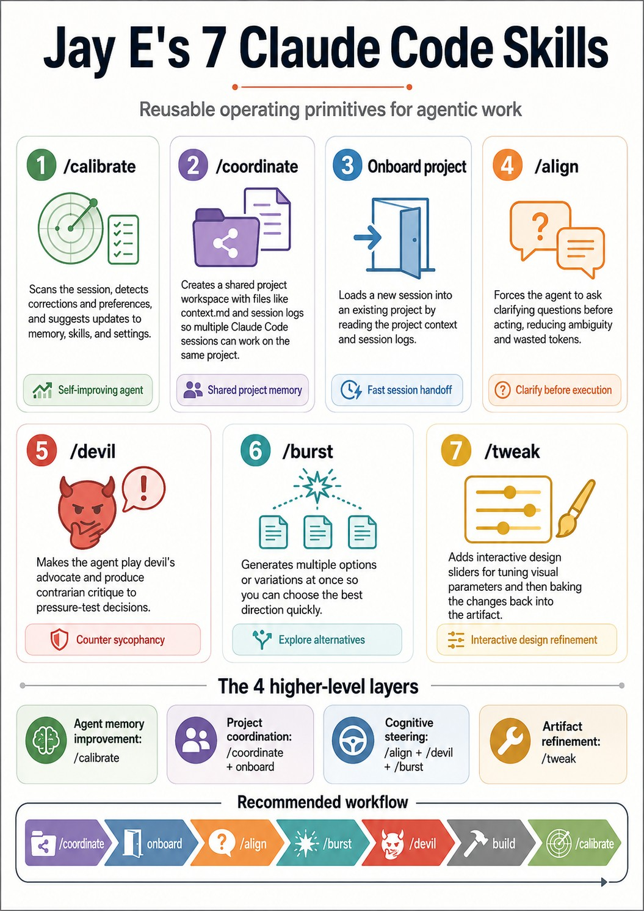

# Agentic Workbench Skills

> **Seven reusable Claude Code primitives for memory, coordination, steering, critique, variation, and refinement.**

This project packages seven Claude Code skills as installable, ready-to-use commands. They are inspired by the practical patterns demonstrated in the YouTube video **"The 7 Claude Code Skills Everyone Should Know"** — watch it at <https://www.youtube.com/watch?v=UpgjdQJShWg&t=14s>.

---

## The big picture: one self-improving loop

The seven skills are not independent tricks. They form a closed feedback loop that makes every Claude Code session better than the last.

<video src="https://github.com/user-attachments/assets/612223ed-4e85-4e15-9364-5a165bc4d034" controls width="100%"></video>



```
┌─────────────────────────────────────────────────────────────────┐
│                  The self-improving agentic loop                │
│                                                                 │
│  /coordinate ──► onboard ──► /align ──► /burst ──► /devil      │
│       │                                              │           │
│       │            build / execute / iterate         │           │
│       │                                              │           │
│       └──────────────── /calibrate ◄─────────────── ┘           │
│                            │                                    │
│                            ▼                                    │
│               Improved skills · memory · settings              │
└─────────────────────────────────────────────────────────────────┘
```

Each skill feeds the next:

| Phase | Skills | What it achieves |
|-------|--------|-----------------|
| **Set up** | `/coordinate` · `onboard` | Shared project memory across all sessions |
| **Clarify** | `/align` | Narrow the solution space before writing a line of code |
| **Explore** | `/burst` | Generate multiple options so you pick the best branch |
| **Pressure-test** | `/devil` | Counter sycophancy and stress-test every decision |
| **Refine** | `/tweak` | Polish visual outputs interactively |
| **Learn** | `/calibrate` | Lock in what worked, fix what didn't — permanently |

The loop closes at `/calibrate`: every correction you make during a session gets folded back into the agent's skills, settings, and memory so the *next* session starts better.

---

## The 7 skills

### 1. `/calibrate` — Agent memory improvement

Scans the current session, detects corrections, preferences, repeated patterns, and friction points, then proposes updates to skills, settings, and memory.

**Use it:** at the end of every session.

```
/calibrate
/calibrate light   # quick sweep when token budget is tight
```

> The self-improving loop starts here. Each calibration compounds: the agent gradually learns your exact preferences, style, and workflow.

---

### 2. `/coordinate` — Shared project workspace

Creates a shared project folder (`shared/projects/<slug>/`) with `context.md` and a session log so every Claude Code session — including parallel ones — works from the same source of truth.

```
/coordinate Build an AI research assistant for academic papers
/coordinate light   # minimal scaffold for small personal projects
```

**Generated structure:**

```text
shared/projects/<slug>/
  context.md        ← project brief and goals
  session-log.md    ← cumulative session notes
  decisions.md      ← architectural decisions
  open-questions.md ← unresolved questions
  status.md         ← current state
  artifacts/        ← generated files
```

---

### 3. `onboard` — Fast session handoff

Loads a new Claude Code session into an existing shared project by reading the project context and session logs. No need to re-explain anything.

```
/onboard ai-research-assistant
```

Combine with IDE "fork conversation" to spin up parallel sessions all working on the same project.

---

### 4. `/align` — Clarify before executing

Forces the agent to ask `n` clarifying questions with lettered answer options before proceeding. Narrows the solution space and prevents wasted tokens on misaligned work.

```
/align 5
```

> Think of align as pre-flight checks. The more specific your answers, the more precisely the agent steers toward your actual goal.

---

### 5. `/devil` — Counter sycophancy

Makes the agent play devil's advocate, generating `n` contrarian critique points, objections, and alternative angles for a plan or decision.

```
/devil 5 on option B
```

Use it to pressure-test tool choices, library decisions, vendor selections, or any implementation direction. LLMs naturally agree — `/devil` reverses that.

---

### 6. `/burst` — Explore variations

Forces the agent to generate `n` distinct options or variations at once. Works for writing, code architecture, design directions, slide layouts, or any open-ended decision.

```
/burst 3 implementation strategies
/burst 3 visual directions for this explainer card
```

> Instead of steering toward one outcome, burst widens the search — then you pick the branch closest to your goal.

---

### 7. `/tweak` — Interactive design refinement

Injects an HTML slider panel into a design or artifact so you can tune visual parameters (title size, spacing, saturation, glow, letter-spacing) interactively. "Baking" the result sends the exact patch back to the agent.

```
/tweak option B
/tweak bake <patch>
```

---

## How the skills work together for self-improvement

The power of this set is not any single skill — it is the compounding effect of the full loop.

```
/coordinate   →  one shared brain for all sessions
  onboard     →  every session speaks the same language
  /align      →  precision before action
  /burst      →  explore widely, not narrowly
  /devil      →  honest critique, not flattery
  build       →  execute with good context
  /tweak      →  visual polish on the output
  /calibrate  →  permanent improvements folded back in
```

Running this loop across sessions produces an agent that progressively knows:
- your personal preferences and terminology
- your project architecture and constraints
- which options you typically reject (and why)
- the style of output you actually want

The result is less time correcting the agent and more time on the work that matters.

---

## The 4 higher-level layers

```
A. Agent memory improvement   →  /calibrate
B. Project coordination       →  /coordinate · onboard
C. Cognitive steering         →  /align · /devil · /burst
D. Artifact refinement        →  /tweak
```

---

## Installation

### macOS / Linux

```bash
bash scripts/install.sh
```

Copies skills into `~/.claude/skills/` and creates `~/agent-workspace/shared/projects/`.

### Windows PowerShell

```powershell
powershell -ExecutionPolicy Bypass -File .\scripts\install.ps1
```

Copies skills into `$HOME\.claude\skills\` and creates `$HOME\agent-workspace\shared\projects\`.

---

## Suggested workflow

```text
/coordinate Build a small AI research assistant for papers
/onboard ai-research-assistant
/align 5
/burst 3 implementation strategies
/devil 5 on option B
# build / edit / test
/calibrate
```

For design / frontend artifacts:

```text
/burst 3 visual directions for this explainer card
/tweak option B
# adjust sliders in browser
/tweak bake <copied patch>
```

---

## Directory layout

```text
agentic-workbench-skills/
  README.md
  MANIFEST.json
  claude_code_seven_skills.jpg     ← skills infographic
  skills/
    calibrate/SKILL.md
    coordinate/SKILL.md
    onboard/SKILL.md
    align/SKILL.md
    devil/SKILL.md
    burst/SKILL.md
    tweak/SKILL.md
  workspace-templates/
    shared/projects/_template/
      context.md
      session-log.md
      decisions.md
      open-questions.md
      status.md
  scripts/
    install.sh
    install.ps1
```

---

## Implementation note

Skill behavior depends on Claude Code's skill discovery and execution semantics. These files are high-quality instruction contracts. Tune descriptions, path conventions, and file update policies to match your environment after first use.

---

## Workspace convention

```text
~/agent-workspace/
  shared/
    projects/
      <project-slug>/
        context.md
        session-log.md
        decisions.md
        open-questions.md
        status.md
        artifacts/
    memory/
      preferences.md
      workflow-defaults.md
      known-frictions.md
```

Keep `context.md` compact. Put verbose research or generated artifacts under `artifacts/`.
